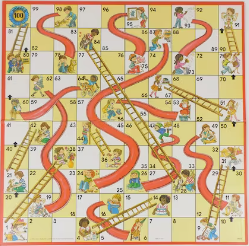

```{r, include = FALSE}
#Libraries
library(mosaic)
library(stargazer)
library(pander)

s_type <- "text"
```

```{r, include = FALSE}
#for knitting
s_type <- "html"
```

```{r}
#Functions

roll <- function(){      #Roll the dice
  spinner <- c(1:6)
  sample(spinner, 1)
}

turn <- function(x) {   #Player's turn
  x + roll()
}


```

```{r}
#dataframes

df <- data.frame("Land" = c(1,4,9,16,21,28,36,47,49,51,56,62,64,71,80,87,93,95,98),
                 "GoTo" = c(38,14,31,6,42,84,44,26,11,67,53,19,60,91,100,24,73,75,78))
df$Cat <- rep(NA, 19)
for (i in 1:length(df$Land)) {
  if(df$Land[i]-df$GoTo[i] < 0) {
    df$Cat[i] <- "Ladder"
  } else {
    df$Cat[i] <- "Chute"
  }
}
```

### The Game

```{r, fig.align = 'center', echo = FALSE}

```

The game of Chutes and Ladders is one that many parents play with young children. It teaches concepts like sportsmanship, counting, the concept of consequences (some versions of the game use images of behavior to show good things happening and climbing the ladder, or bad things that cause you to slide down), and the joy that can come from a board game. The issue for many parents, is that it is rather boring for the adult, and can sometimes seem to take an eternity.

My goal in this project was to create an estimate of the amount of time that can expected to be put into playing `Chutes and Ladders`. In other words, how much time will I be committing to when I agree to play this game with my child.

##### The Way it is Played

The instructions for the game are not difficult, you roll a die, and move that number of squares. There are a series of squares that correspond with actions that are good or bad. The good behaviors allow the player to climb a ladder, and gain an advantage to winning the game. The actions that are bad actions cause the player to fall down a slide, or chute, causing them to fall further away from the finish line. 

Once at the finish line, the player is required to land on the final `100` square by exact count. Meaning that if you are 2 squares away, and you roll a 3, your turn is skipped and you may try again on your next turn.

### The Turns

With the background information taken care of, let's get into the interesting part, and look at the average number of turns.

```{r, comment = NA}
player_test <- NULL
N <- 10000
turns <- NULL

for (i in 1:N) {
  player <- 0
  turn_temp <- 0
  while (player < 101) {
    this_roll <- roll()
    if(player + this_roll == 100 | player == 100) {
      #player <- player + this_roll
      break
    } else if(player + this_roll >100){
      next
    } else {
      player <- player + this_roll
    }
    for (j in 1:length(df$Land)) {
      if(player == df$Land[j]) {
        player <- df$GoTo[j]
      } else {
        next
      }
    }
    turn_temp <- turn_temp + 1
  }
  #player_test[i] <- ifelse( player == 100, player, player + this_roll )
  #turns[i] <- turn_temp
  player_test <- append(player_test, ifelse(player == 100, player, player + this_roll))
  turns <- append(turns, turn_temp)
}

#ifelse(sum(player_test) != 100*N, "Error in Turns", "Simulation Worked")
```

Let's start by looking at a graph of the distribution of the amount of turns that have been required to complete the game.

```{r}
hist(turns, col = "skyblue", 
     xlab = "Numer of Turns in the Game", 
     main = "Histogram of Amount of Turns Taken in Chutes and Ladders")
favstats(turns)[1:7] %>% 
  pander()

#stargazer(turns, type = s_type)
```

##### Discussion of Graph

As can be seen, the distribution for the amount of turns it takes to finish Chutes and Ladders is incredibly right skewed. Frankly, that is the result that I would want. Evenly distributed, or left skewed data, would mean that the average number of turns would be incredibly high.

##### Discussion of Descriptive Statistics

```{r}
stand.dev <- sd(turns)
stand.error <- stand.dev / sqrt(N)
t.s <- qt(p = 0.05/2, df = N-1)
marg.err <- t.s * stand.error
```

When working with skewed data, the best option is to use the `median` value instead of the mean. One reason for this, just in the amount of time that I have been working with the data, the `median` has stayed at `r median(turns)` turns, while the `mean` has fluctuated each time. Even with the fluctuation, we can expect that it will remain between `r round(mean(turns) + marg.err, 2)` and `r round(mean(turns) - marg.err, 2)`. 

Later in the analysis, I use the `mean` to calculate average amount of time to complete the game per person. This is to implement the ability to use the `standard deviation` to give a range of time.

### Overall Outcome

If we assume that an average turn takes `30 seconds`, it would mean that, on average, the whole game would take about **`r round(mean(turns)*.5, 2)`** minutes, times however many players are participating. Over 50% of the games will take from **`r round((mean(turns) - (sd(turns)))*.5, 2)`** to **`r round((mean(turns) + (sd(turns)))*.5, 2)`** minutes per game.

*Note You would double the amount of time if there are two players, and quadrupal the time if there are four players. Likewise, if your turns take less time, such as `15 seconds` per turn, you would take half that amount of time.*
